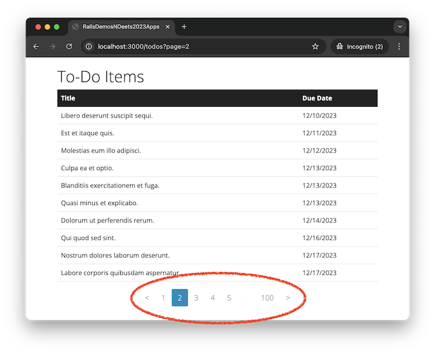

# Pagination with Pagy

This demonstration shows how to use the [Pagy](https://github.com/ddnexus/pagy#readme) gem to add pagination to the todos index page from the [Index Pages Demo](https://rails-demos-n-deets-2023.herokuapp.com/demos/index-pages).

If you would like to follow along with the video, clone this repo and switch to the `version-before-demo` branch. The `main` (default) branch holds the solution.

## Video Demo (16 minutes)

- <https://youtu.be/jRvoGUCMzhM?si=XGGdh_7N1JbPBrEn>

## Add 1000 Todo Seeds

- Add Faker to project.
  - See <https://github.com/faker-ruby/faker#getting-started>
  - Add `gem 'faker'` to `Gemfile`
  - Add `require 'faker'` to `db/seeds.rb`
- Update `db/seeds.rb` to generate 1000 `Todo` objects
  - `1000.times do ...`
  - `Faker::Lorem.sentence`
  - `Faker::Lorem.paragraph,`
  - `Faker::Date.between(from: 1.year.ago, to: 1.year.from_now)`

## Add Pagination to Todo Index (10 per page)

- Add Pagy to project.
  - See <https://ddnexus.github.io/pagy/quick-start/>
  - Add `gem 'pagy', '~> 9.3'` to `Gemfile`
  - Save <https://ddnexus.github.io/pagy/gem/config/pagy.rb> to `config/initializers`
    - Uncomment `require 'pagy/extras/bootstrap'`
  - Add `include Pagy::Backend` to `ApplicationController`
  - Add `include Pagy::Frontend` to `ApplicationHelper`
- Update how `Todo` objects are retrieved in `TodosController.index`
  - `@pagy, @todos = pagy(Todo.order(:due_date), limit: 10)`
- Add the pagination buttons to `app/views/todos/index.html.erb`
  - `<%== pagy_bootstrap_nav(@pagy, classes: 'pagination mx-auto') %>`

## Further Reading

- [Faker Homepage](https://github.com/faker-ruby/faker#readme)
- [Faker Documentation](https://www.rubydoc.info/gems/faker/)
- [Pagy Homepage](https://github.com/ddnexus/pagy#readme)
- [Pagy Documentation](https://ddnexus.github.io/pagy/)
